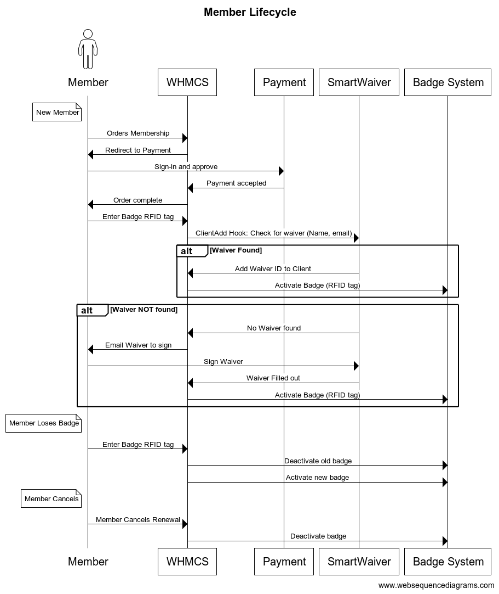

# WHMCS Extensions

This project is storage for extending WHMCS, which is TheLab's Member Management system.

## About the Project

To manage members and guests for TheLab, we need to consider:
* Payment
  * New Member, Cancellation, Membership Points
* Badge
  * Automation with our Access Control System
* Waiver
  * All members and guests must sign an electronic waiver
* Commmunication
  * Reaching out to members for special events (elections, etc.)
* Voting
  * Is the member a voting member?

## Usage

The high level flow of the design is based off of this flow diagram:

## Resources 
* [Documentation for writing WHMCS hooks](https://developers.whmcs.com/hooks/)
* [Source Code for TheLab WHMCS hooks](src/hooks)

## License

Distributed under the MIT License. See LICENSE for more information.

## Contact

Email: CTO @ TheLab.ms

Slack: https://thelab.slack.com #access-control 

